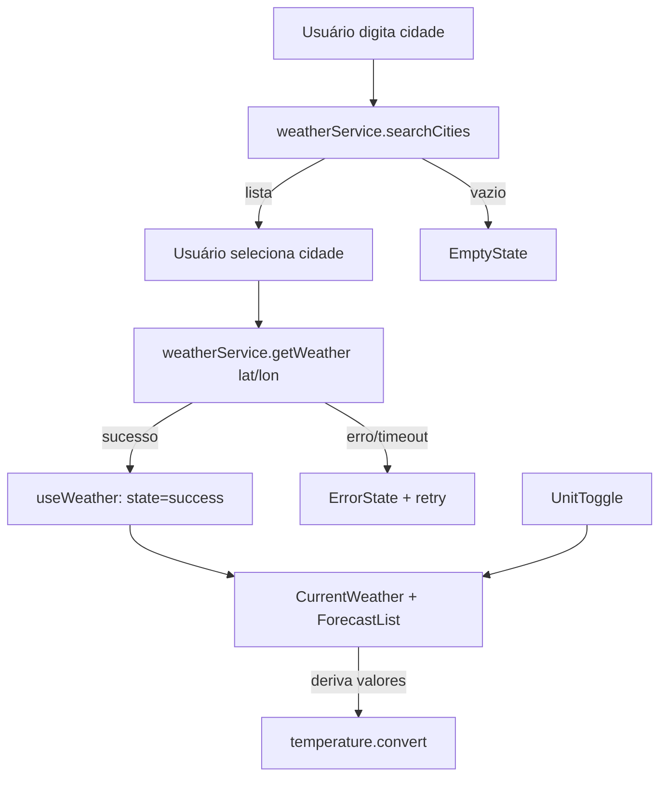

# Solução de referência — (`plans/weather-app-plan.md`)

> Referência. Seu plano pode variar nos detalhes.

---

## Architecture

SPA React com **arquitetura em camadas** e fluxo de dados unidirecional:

- **Apresentação** (`components/`): componentes puros de UI, recebem dados via props.
- **Orquestração** (`hooks/`): `useWeather` gerencia busca, estado e erros.
- **Acesso a dados** (`services/`): chamadas HTTP à Open-Meteo, isoladas e mockáveis.
- **Funções puras** (`lib/`): conversão de unidade, formatação de data, mapeamento
  de código de clima → rótulo/ícone.
- **Contratos** (`types/`): interfaces compartilhadas.

## Tech Stack

| Camada      | Tecnologia            | Justificativa                              |
| ----------- | --------------------- | ------------------------------------------ |
| Linguagem   | TypeScript (strict)   | Segurança de tipos, contratos explícitos   |
| UI          | React + Vite       | Rápido, simples, ideal para SPA estática   |
| Estilo      | Tailwind CSS          | Produtividade + tema dark glassmorphism    |
| Testes unit | Vitest + Testing Lib  | Integra com Vite, rápido                    |
| Testes E2E  | Playwright            | Fluxos reais + viewport mobile             |
| Dados       | Open-Meteo            | Gratuito, sem API key, deploy estático      |

## Project Structure

```text
src/
├── components/
│   ├── SearchBar.tsx
│   ├── CurrentWeather.tsx
│   ├── ForecastList.tsx
│   ├── ForecastCard.tsx
│   ├── UnitToggle.tsx
│   └── states/ (Loading, ErrorState, EmptyState)
├── hooks/
│   └── useWeather.ts
├── services/
│   └── weatherService.ts
├── lib/
│   ├── temperature.ts   # conversão C/F
│   ├── weatherCodes.ts  # código → rótulo/ícone
│   └── format.ts        # datas
├── types/
│   └── weather.ts
└── App.tsx
```

## Data Model

```ts
export type Unit = 'celsius' | 'fahrenheit';

export interface City {
  id: number;
  name: string;
  country: string;
  admin1?: string; // estado/região
  latitude: number;
  longitude: number;
}

export interface CurrentWeather {
  temperature: number; // sempre em °C internamente
  weatherCode: number;
  humidity: number;
  windSpeed: number;
  pressure: number;
  precipitation: number;
  time: string;
}

export interface ForecastDay {
  date: string;
  min: number; // °C
  max: number; // °C
  weatherCode: number;
  precipitationProbability: number;
}

export interface WeatherData {
  city: City;
  current: CurrentWeather;
  forecast: ForecastDay[]; // 5 itens (hoje + 4)
}
```

> Decisão: **armazenar sempre em Celsius** e **converter na apresentação**. A
> troca de unidade não dispara novo request.

## Data Flow



## External APIs

**Geocoding**
```
GET https://geocoding-api.open-meteo.com/v1/search?name={city}&count=5&language=pt&format=json
```
Resposta → `results[]` mapeado para `City[]`.

**Forecast**
```
GET https://api.open-meteo.com/v1/forecast
    ?latitude={lat}&longitude={lon}
    &current=temperature_2m,relative_humidity_2m,wind_speed_10m,surface_pressure,precipitation,weather_code
    &daily=weather_code,temperature_2m_max,temperature_2m_min,precipitation_probability_max
    &forecast_days=5&timezone=auto
```
`current` → `CurrentWeather`; `daily` (arrays paralelos) → `ForecastDay[]`.

## State Management

- Estado central no hook `useWeather` (sem libs externas).
- Máquina de estados simples: `idle | loading | success | error | empty`.
- `unit` é estado de UI; a conversão é **derivada** via `lib/temperature.ts`.

## Error Handling

- `weatherService` lança erros tipados; o hook converte em `state='error'`.
- Timeout via `AbortController`.
- Resposta parcial → campos ausentes exibidos como "—".
- `ErrorState` oferece ação "tentar novamente".

## Testing Strategy

- **Vitest:** `temperature.ts` (conversão), `weatherCodes.ts`, `weatherService`
  (mock de `fetch`, sucesso e falha), componentes (loading/erro/vazio/sucesso).
- **Playwright:** fluxo buscar → selecionar → ver clima → trocar unidade → ver
  previsão; teste em viewport mobile; `page.route` para respostas determinísticas.

## Risks & Trade-offs

- **Sem cache:** simples, mas refaz request a cada busca. Aceitável na v1.
- **Sem lib de estado:** menos dependências; hook único suficiente para o escopo.
- **Conversão derivada vs. armazenada:** derivar evita estado duplicado e bugs de
  sincronização (trade-off: recomputar a cada render — custo desprezível).

